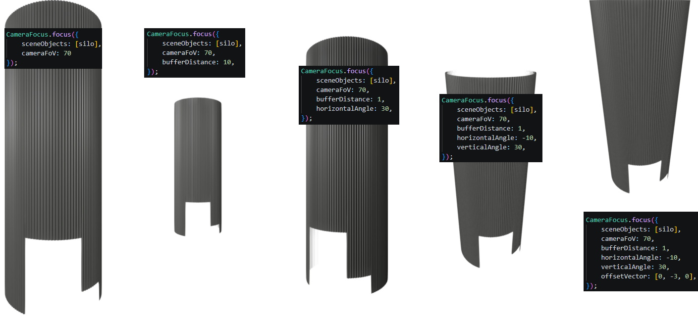

# CameraFocus

A module for automatically focusing the camera on certain objects in the scene.



For a detailed documentation of the public functions, please see the JSDoc comments
in [src/camerafocus/CameraFocus.js](src/camerafocus/CameraFocus.js).

## Using CameraFocus in VisLogic

```javascript
//any file in vislogic
//import
import { CameraFocus } from "./VisLogicUtilities/src/camerafocus/CameraFocus.js";
//use
let myObj = core.scene.create(core.assets("some/asset"));
CameraFocus.focus({ sceneObjects: [myObj], cameraFoV: 70 }); //minimal parameters
CameraFocus.focus({ sceneObjects: [myObj], cameraFoV: 70, bufferDistance: 3, horizontalAngle: 20, verticalAngle: 10 }); //with optional parameters
CameraFocus.focus({ sceneObjects: [myObj], cameraFoV: 70, offsetVector: [0, 1, 0] }); //shift the rotation center upward by 1 meter
```

## Public Functions
These are the supported public functions you can use in your code.

### focus(options)
Focuses the camera on the specified scene objects. This will perform a `core.scene.camera.lookAt()` with the rotation center being the center of the combined bounding boxes of all specified scene objects (shifted by `offsetVector` if provided). The camera position is calculated from the remaining parameters.

**Parameters**

`options` is a plain object with the following properties:

| Name | Type | Required | Description | Default |
| ---- | ---- | ---- | ---- | ---- |
| `sceneObjects` | `core.SceneObject[]` | yes | List of sceneObjects to focus on. The rotation center of the camera will be at the center point of the combined axis-aligned bounding boxes of all of these. | |
| `cameraFoV` | `Number` | yes | Vertical Field of View angle in degrees of the currently active camera. Required for accurate calculations. | |
| `bufferDistance` | `Number` | no | Distance in meters added to the edges of the resulting frame. Gives finer control over the zoom level of the result. | `0` |
| `horizontalAngle` | `Number` | no | Horizontal angle in degrees counter-clockwise relative to looking down the Z axis. | `0` |
| `verticalAngle` | `Number` | no | Vertical angle in degrees counter-clockwise relative to looking down the Z axis. | `0` |
| `offsetVector` | `Number[3]` | no | XYZ offset applied to the bounding-box center point before passing it as the rotation center to `lookAt`. Does not affect the computed camera position. | `[0, 0, 0]` |
