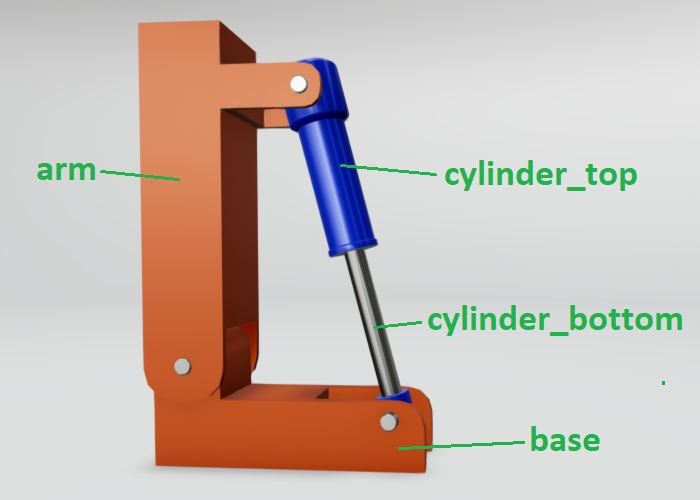

# RecordSyncAnimation — Example Project

## The Assembly

The scene consists of four parts: a fixed `base`, a rotating `arm`, and a two-part hydraulic cylinder (`cylinder_top` and `cylinder_bottom`). The arm is driven directly with a simple rotation, but the cylinder parts are connected through docking points — their angle and extension are resolved by geometry, not by a direct property assignment.

Because of this, a plain linear animation from start to end position would not work for the cylinder: the intermediate positions would be geometrically wrong. Instead, `main.js` steps the arm through its full range of motion frame by frame, computes the correct cylinder geometry at each step, and records the result using `AnimationKeyFrameRecorder`. The recorded keyframe dataset can then be played back accurately at runtime by `SyncAnimationsPlayer` without re-running any geometry calculations.

## Setup

1. Copy the contents of this folder into a new empty directory on your machine.
2. Place the `VisLogicUtilities` repository inside the `visualLogic/` folder so the import paths resolve correctly.
3. Open `record_sync_animation.json` in VIZStudio to initialize the visualization project.
4. Open the VIZStudio **Asset Editor** and import all four FBX files from the `visualAssets/` folder.
5. Start the VIZStudio **Preview**.
6. The recording process starts immediately and prints the keyframe dataset JSON to the console.